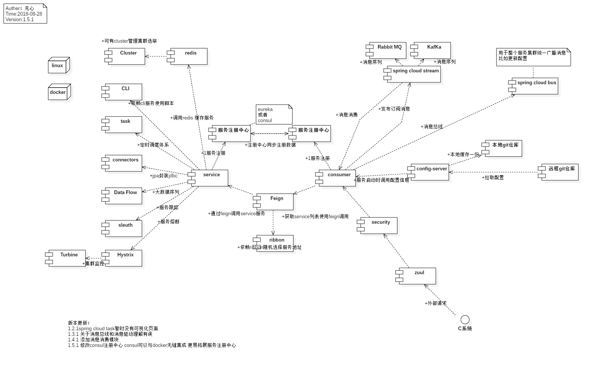
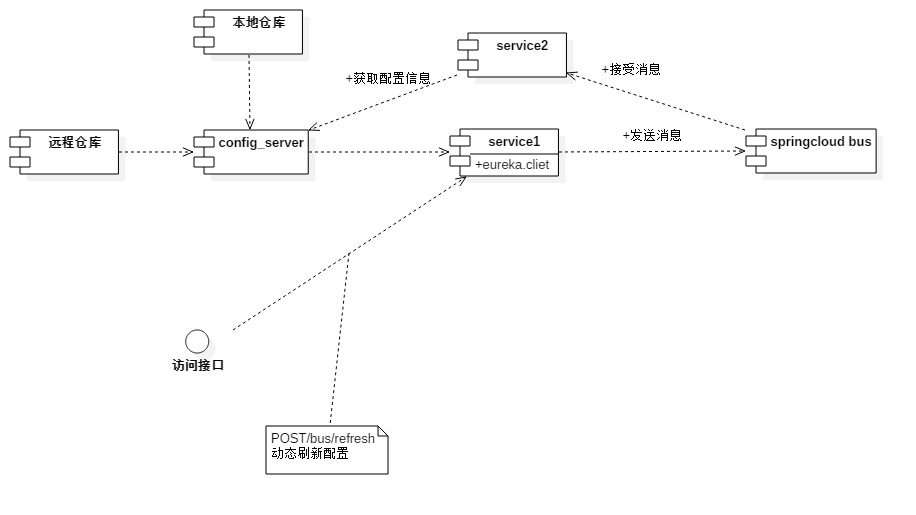
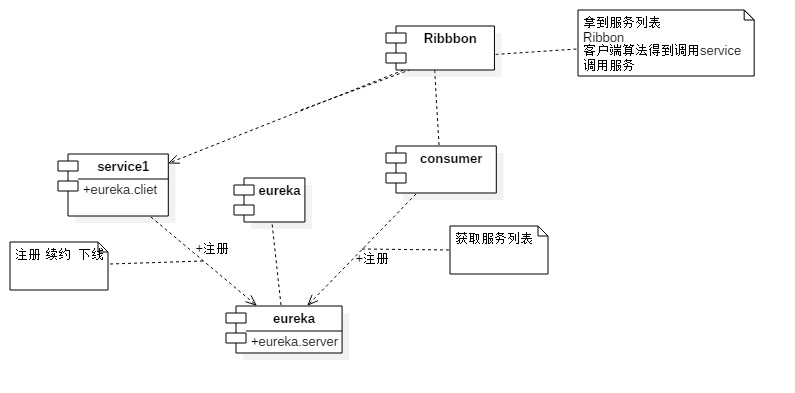
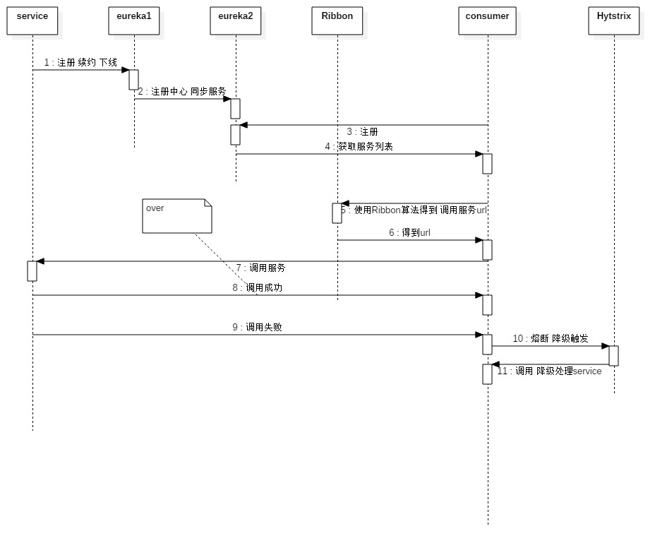

# base-cloud

#### 项目介绍
使用spring cloud 搭建微服务应用架构

满足中小团队 项目初始化过程 更快捷的应用spring cloud服务体系


#### 代码分支 


##### master
    项目设计图纸

##### 1.5.X-boot【maven】
    spring-boot-starter 1.5版本

##### 2.0.X-boot【gradle】
    spring-boot-starter 2.0.版本
    
    1.5版本和2.0版本还是有相当差别的 
    springboot 1.5 为 spring-context 4.0
    springboot 2.0 为 spring-context 5.0
    
    另 1.5与2.0的 starter autoconfig 也对cloud-data组件有很大的不兼容性


##### develop【gradle】
    SOA服务 拆分到了各个微服务模块【api、service、repository】【暂时不知道合不合理 欢迎提issus】


#### 软件架构
软件架构说明

###### cloud设计图纸-截止到编辑日志



######  动态刷新配置流程图


######  服务治理框架图


######  服务注册到调用时序图


###### 官方的设计图纸


#### 功能介绍
```
已完成功能列表

1、集成mybatis 打通数据流流转
2、服务监控模块 、turbine、hystrix-dashboard
3、服务日志收集系统、ELK服务模块部署【简书:https://www.jianshu.com/p/542e1d1fb49d】
4、网关过滤模块
5、服务跟踪模块
6、服务服务注册模块 eureka
7、服务调用feign、服务熔断hystrixCommand
8、远程配置刷新
9、集成消息队列
10、message-queue改为 java config方式 
11、集成redis 使用spring-data-redis
12、统一引入外部配置
13、抽离mybatis框架 作为starter 引入【jpa、mybatis解耦和】 待解决bug


未完成功能列表

1、url统计次数【可在api-gateway上添加url统计次数、还可以输出url-time、开关控制】
2、
3、集中权限管理【OAuth】
4、集成email sms中心
5、监控模块添加预警功能【调用 email sms服务】
6、
7、docker一键执行部署脚本
8、..

```


#### 安装教程

1. copy base-cloud-config 至你的项目
2. 修改配置文件中的远程仓库配置
3. 启动eureka、config服务
4. 启动service-monitor、service-track等服务监控
5. 启动服务实例

#### 使用说明


1. 服务端口按照各个分支控制
2. 远程配置中心 http://config.wuxinvip.com/
3. 远程注册中心 http://eureka.wuxinvip.com/ 或者 http://eureka.springcloud.cn/


config.wuxinvip.com eureka.wuxinvip.com已停用 配置中心建议自己运行在内网


### 不再维护、感兴趣的自己扩展服务吧

[github上spring cloud服务源码](https://github.com/spring-cloud)

###[文档中心](https://gitee.com/none_heart/cloud-doc)

